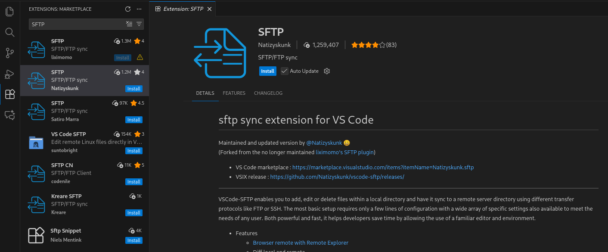

# 🐘 PHP Setup Guide (with SFTP in VS Code)

## 📁 1. Create a project folder on your system

```bash
mkdir php
```

---

## 📝 2. Open the `php` folder in **VS Code**

## 🔌 3. Install SFTP Extension in VS Code

1. Go to **Extensions** tab
2. Search **"SFTP"**
3. Install the SFTP extension
- VS Code marketplace : https://marketplace.visualstudio.com/items?itemName=Natizyskunk.sftp

   

---

## ⚙️ 4. Create SFTP configuration

Inside your `php` folder:

### ➕ Create `.vscode` folder

```bash
mkdir .vscode
```
```bash
cd .vscode
```

---

## **Create the Configuration File**

* Right-click on your project folder in **VS Code**
* Click **Command Palette** (`Ctrl + Shift + P` or `Cmd + Shift + P`)
* Type: **SFTP: Config**
* Select: **SFTP: Config**
  → It will create a file called **sftp.json** in your **.vscode/** folder.

---

### 🛠️ Create `sftp.json`

```bash
vim sftp.json
```

Paste this configuration:

```json
{
    "host": "192.168.1.50",
    "username": "root",
    "password": "root",
    "protocol": "sftp",
    "port": 22,
    "uploadOnSave": true,
    "syncOption": { "update": true },
    "context": "./",
    "remotePath": "/var/www/html/php"
}
```
Press **Ctrl + S** 💾 to save.

---

## 🔑 **SFTP Config Keys & Their Meanings**

| **Key**          | **Meaning**                                                   |
| ---------------- | ------------------------------------------------------------- |
| **host**         | Your server's IP address or hostname                          |
| **username**     | Your SSH username                                             |
| **password**     | Your SSH password (or use `privateKeyPath` instead)           |
| **port**         | Usually **22** for SFTP                                       |
| **uploadOnSave** | Automatically upload file on save                             |
| **remotePath**   | The remote directory where files go                           |
| **context**      | Local folder to sync (`"./"` = root of project)               |
| **syncMode**     | `update`, `full`, etc. (`update` = update changed files only) |

---

## 🔧 **4. Useful Commands**

Open the Command Palette (`Ctrl + Shift + P`):

* **SFTP: Upload File**
* **SFTP: Upload Folder**
* **SFTP: Download File**
* **SFTP: Download Folder**
* **SFTP: Diff** *(compare local and remote)*

---

Then go back:

```bash
cd ..
```

---

## 🖥️ 5. Create folder on the `server`

Go to the server & create the folder here:

📍 **Location:** `/var/www/html/`

```bash
mkdir php
```

---

## 📄 6. Create `phpinfo.php` in VS Code `Clinet` 

```bash
vim phpinfo.php
```

Add this code:

```php
<?php
    phpinfo();
?>
```

Press **Ctrl + S** 💾 to save.

Since SFTP is enabled with *uploadOnSave*, the file will upload automatically.

---

## 🔍 7. Verify file upload on `server`

Check this path: `/var/www/html/php`

```bash
ls -lh
```

### 📦 Expected Output:

```
total 4.0K
-rw-r--r-- 1 root root 23 Dec  4 10:26 phpinfo.php
```

---

🎉 **Your PHP setup with SFTP in VS Code is complete!**
You can now open in browser:

👉 `http://your-server-ip/php/phpinfo.php`

---
## Codes Of PHP : `vscode`

Create a File in vscode: `index.html`

```html
<!DOCTYPE html>
<html lang="en">
<head>
    <meta charset="UTF-8">
    <meta name="viewport" content="width=device-width, initial-scale=1.0">
    <title>Welcome to Web-Pentestion-Testing</title>

    <style>
        body {
            font-family: Arial, sans-serif;
            background-color: #f4f4f4;
            margin: 0;
            padding: 0;
            display: flex;
            justify-content: center;
            align-items: center;
            height: 100vh;
        }

        h1 {
            color: #333;
            background: #fff;
            padding: 20px 40px;
            border-radius: 10px;
            box-shadow: 0 4px 6px rgba(0, 0, 0, 0.1);
        }
    </style>
</head>

<body>
    <h1>Welcome to Armour Infosec</h1>
</body>
</html>
```

- Brower URL:
http://192.168.1.50/php/index.html

---


> `Homework:` Before we start **Web Application Pentest**.You can read and go through HTML and CSS and Javascript , Java ,Pyhton, DotNet.

- **JavaScript**: https://youtube.com/playlist?list=PLlasXeu85E9cQ32gLCvAvr9vNaUccPVNP&si=-SGkb5cafUbvBmaa
