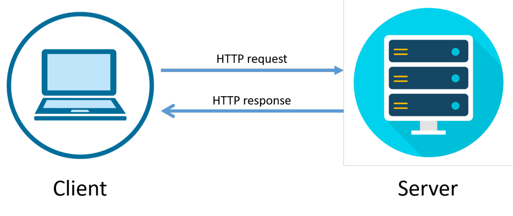

# Ways-to-Get-Data-from-Users-on-the-Web

## ✅ All Ways to Get Data from Users on the Web

There are **multiple methods**, grouped into **three broad categories**:


---

## ⏱️ 1. Via HTTP Requests

Users send data to the server through requests made from the browser.

### 📌 Methods:

### 🔹 GET Request (via URL/Link)
- Data is included in the URL as query parameters  
- Example:  

```url
[https://example.com/search?q=shoes]
```

### 🔹 POST Request (via Form or JavaScript)
- Data is sent in the **body** of the HTTP request  
- Commonly used for forms and sensitive data

### 🔹 PUT / DELETE / PATCH
- Used mainly in **APIs**
- For updating or deleting data
- Usually sent via JavaScript

### 🔹 AJAX / Fetch / Axios (JavaScript)
- JavaScript sends **asynchronous** requests to the server
- Can use **any HTTP method**
- Data may be included in:
    - URL
    - Request body

---

## 📝 2. Via HTML Forms

Forms allow users to input and submit data.

### 📌 Features:
- Uses **GET** or **POST** method
- Can send:
- Text inputs
- Passwords
- Emails
- Files
- Hidden values
- Data is sent to the server when the form is submitted

---

```html
<form action="/submit" method="POST">
  <input type="text" name="username" />
  <input type="submit" value="Submit" />
</form>
```

---

## 🍪 3. Via HTTP Headers

### 📌 Common Examples:

* **Cookies**

  * Automatically sent with each request
  * Used for sessions, user preferences, tracking

* **Authorization Headers**

  * Used for authentication tokens like **JWTs**

* **Custom Headers**

  * Apps can include additional data
    *(e.g., device info, language)*

---

## 🧠 4. Via Web APIs & Client-Side Interactions

Not part of standard HTTP requests by default, but these collect data locally and often send it using HTTP later.


### 📌 Examples:

#### 🌐 Web APIs (JavaScript)
- **`navigator.geolocation`** – Get user's location  
- **`MediaDevices.getUserMedia()`** – Access camera/microphone  
- **`localStorage`, `sessionStorage`** – Store and later send user preferences  
- **Battery API, Network Information API** – Device / environment data  


#### 🔁 WebSockets / WebRTC
- Real-time, bidirectional communication channels  
- Often used for chat, gaming, live collaboration  


#### 📁 File Upload APIs
- Input fields (`<input type="file">`) and drag-and-drop events  
- Data sent via **POST** or JavaScript (e.g., `FormData`)  


#### 📊 Client-Side Event Tracking
- JavaScript tracks interactions (clicks, scrolls, hovers)  
- Data sent asynchronously to analytics services  

---

## 🔢 Summary: Main Categories

| **Category**        | **Methods**                                                                 |
|---------------------|------------------------------------------------------------------------------|
| **HTTP Requests**   | GET, POST, PUT, DELETE, PATCH, Fetch / AJAX                                  |
| **HTML Forms**      | Form inputs using GET or POST                                                 |
| **HTTP Headers**    | Cookies, Authorization headers, Custom headers                                |
| **Web APIs & Extras** | Geolocation, Media access, Storage, WebSockets, WebRTC, Event tracking |
