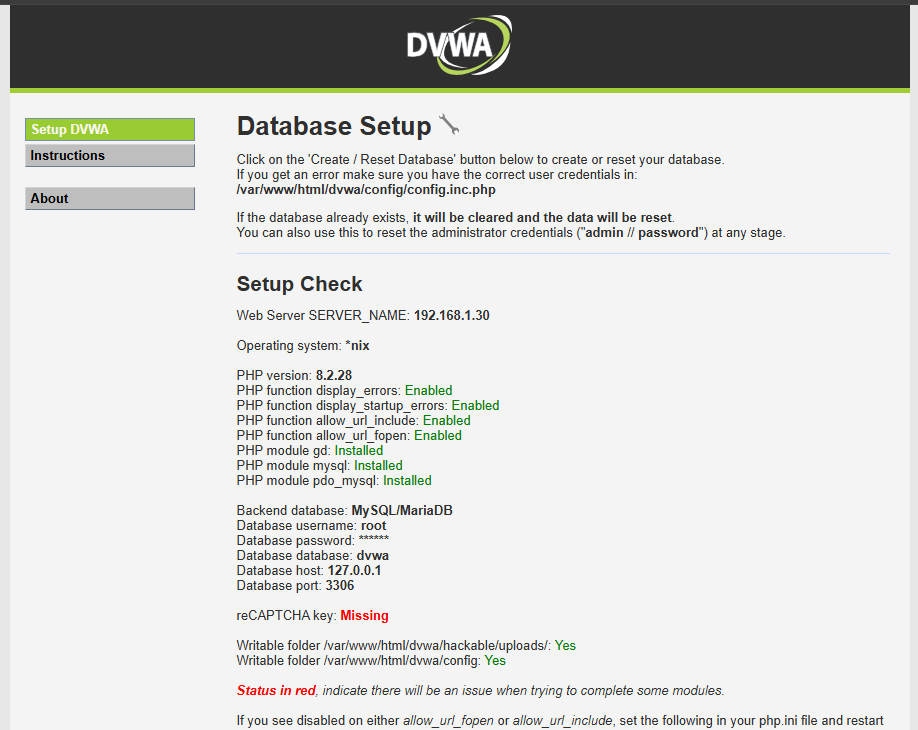
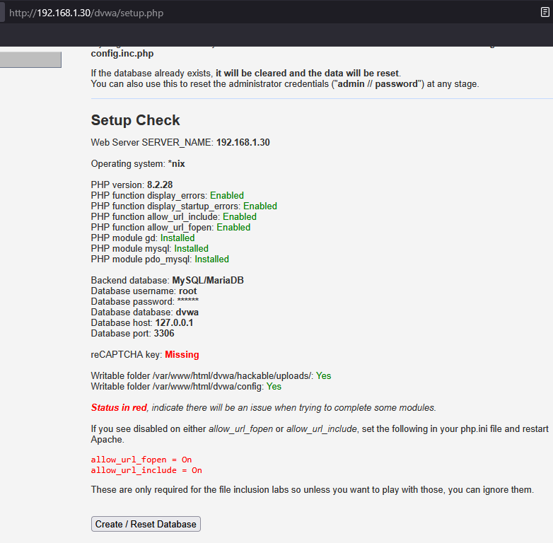
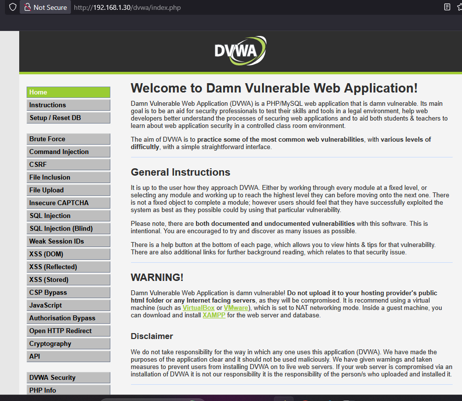

# DVWA Lab Setup
- This document outlines the steps for setting up the **Damn Vulnerable Web Application (DVWA)** environment for penetration testing and educational purposes.
---

## 1. Download and Transfer DVWA

First, download the latest release of DVWA from GitHub:

- **DVWA Release**: [DVWA Release 2.5](https://github.com/digininja/DVWA/releases)

Once the DVWA package is downloaded, transfer the zip file to the server using SCP:

```bash
scp DVWA-2.2.2.zip root@192.168.1.32:/root/
```
## Step 2: Install DVWA
- Now, SSH into the server and follow these steps.

SSH into the server:
```bash
ssh root@192.168.1.311
```
Unzip the DVWA package:

```bash
unzip DVWA-2.5.zip
```
Move the extracted DVWA folder to the web directory:
```bash
mv -v DVWA-2.5 /var/www/html/dvwa
```
Navigate to the web directory (optional):

```bash
cd /var/www/html/dvwa
```

Change ownership of the DVWA directory to the web server user (www-data):

```bash
chown -Rv www-data:www-data /var/www/html/dvwa
```
Ensure the correct permissions:
```bash
chmod -R 755 /var/www/html/dvwa
```
## Step 3: Configure DVWA
Navigate to the configuration directory:

bash
```bash
cd /var/www/html/dvwa/config
```
Copy the default configuration file:

```bash
cp -v config.inc.php.dist config.inc.php
```

Change ownership of the configuration file to www-data:

```bash
chown -v  www-data:www-data config.inc.php
```

Edit the config.inc.php file:

Open the configuration file for editing:
```bash
vim config.inc.php
```

Inside the file, configure the database settings to match your MySQL configuration:


```php
$_DVWA[ 'db_server' ] = 'localhost';
$_DVWA[ 'db_database' ] = 'dvwa';
$_DVWA[ 'db_user' ] = 'root';  // or your MySQL username
$_DVWA[ 'db_password' ] = '';  // or your MySQL password
```
## Step 4: Configure PHP for DVWA
1.  Edit the PHP configuration file to enable certain options:
    
    Open the PHP configuration file (php.ini) for editing:
        
    ```bash
    vim /etc/php/8.2/apache2/php.ini
    ```

2. Add or modify the following settings: **php.ini**

- Enable **allow_url_include**:

    Find and set the value to **On**:

    ```bash
    allow_url_include = On
    ```

- Enable allow_url_fopen:

    Find and set the value to **On**:
    ```bash
    allow_url_fopen = On
    ```
- Enable **display_errors**:

    Find and set the value to **On**:
    ```bash
    display_errors = On
    ```
- Enable display_startup_errors:
    Find and set the value to On:
    ```bash
    display_startup_errors = On
    ```
- Save the file and exit:

    :wq!

    Press Esc, type :wq to save, and press Enter.

## 5. Restart Apache to apply the changes:
To apply changes, restart the Apache service by running the following command:
```bash
systemctl restart apache2.service
```
## 6. Access DVWA
Open your browser and navigate to the following address:

```bash
http://192.168.1.30/dvwa/
```
If your are visit the **DVWA** is show error from Databases ,then you can creat a database

Login into a database:
```bash
mysql -u root -p
```
Now, Create a database **dvwa**:
```bash
CREATE DATABASE dvwa;
```
Now, Check Database is Create :
```bash
 show databases;
```

http://192.168.1.30/dvwa/login.php

Without Enter Id ,Password Click Login
Now, you can show the login Database Setup page


Slide Down Click **Create/Reset Database button**


## Default Credentials

Default username = admin

Default password = password

