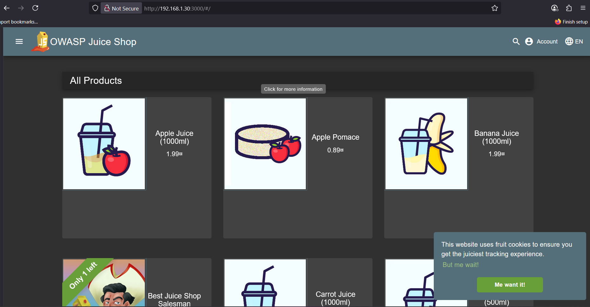
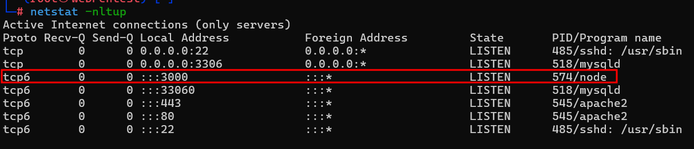

# OWASP Juice Shop Installation Guide

## 1. Prerequisites

Before starting the installation, please review and ensure you have access to the following resources:

- [Official OWASP Juice Shop Website](https://owasp.org/www-project-juice-shop/)
- [OWASP Juice Shop GitHub Repository](https://github.com/juice-shop/juice-shop)
- [Packaged Distributions for Juice Shop](https://owasp.org/www-project-juice-shop/#downloads)
- [Node.js Download and Installation Instructions](https://nodejs.org/)

## 2. System Update and Setup

Ensure your system is up-to-date and ready for installation.

### Update the package list and upgrade existing packages

```bash
apt update
```
```bash
apt upgrade -y
```
### Install curl (if not already installed)
```bash
apt install curl -y
```
### Edit the Hostname (Optional)
To change your system's hostname:

```bash
vim /etc/hostname
```
Also consider updating the /etc/hosts file to reflect the new hostname.

Reboot the System to Apply Changes
```bash
reboot
```
## OWASP Juice Shop Installation Guide

## 3. Install Node.js (Version 22)

### Ensure Compatibility with Node.js

Refer to the official Node.js compatibility information:

- [Node.js Official Site](https://nodejs.org/)
- [Juice Shop GitHub - Compatibility](https://github.com/juice-shop/juice-shop#technology-stack)

---

### Set Up the Node.js v22.x Repository

Use the NodeSource setup script to configure the repository and install Node.js 22.x:
- [https://deb.nodesource.com/](https://deb.nodesource.com/)

```bash
curl -fsSL https://deb.nodesource.com/setup_22.x | bash -
```
```bash
apt-get install -y nodejs
```
- Verify Node.js and npm installation:
```bash
node --help
node -v
node --version
```
### Juice Shop Releases Page:

You can find all official OWASP Juice Shop releases here:

- [Juice Shop GitHub Releases](https://github.com/juice-shop/juice-shop/releases)

- Download the appropriate Juice Shop release (v18.0.0/juice-shop-18.0.0_node22_linux_x64.tgz)

```bash
wget https://github.com/juice-shop/juice-shop/releases/download/v18.0.0/juice-shop-18.0.0_node22_linux_x64.tgz
```
##  4.Verify the Integrity of the Downloaded File

Verify the integrity of the downloaded file to ensure it has not been tampered with.

Example (replace with actual hash or GPG verification as needed):

```bash
sha256sum juice-shop-18.0.0_node22_linux_x64.tgz
```
sha256 : aecbb7fae13a8e75f660310955c124d373469a8a60a500a0bdcdb9e30bb0e5d8

Original to compair website :  aecbb7fae13a8e75f660310955c124d373469a8a60a500a0bdcdb9e30bb0e5d8

## 5.Extract and Move Juice Shop Files
- Extract the downloaded Juice Shop archieve:
```bash
tar -xvf juice-shop-18.0.0_node22_linux_x64.tgz
```
- Move the extracted Juice Shop directory to **/opt**:
```bash
mv -v /root/juice-shop_18.0.0 /opt
```
## 5.Start Juice Shop
- Change to the Juice Shop Directory:
```bash
cd /opt/juice-shop_18.0.0
```
- Start Juice Shop:
```bash
npm start
```
- Visit on The browser: 
```bash
http://192.168.1.30:3000
```


## 6.(Optional) Create a Start Script for OWASP Juice Shop

You can create a simple script to easily start OWASP Juice Shop manually.

### Step 1: Create the script

Create a new file:
```bash
vim /usr/local/bin/juice-shop-start.sh
```

Add the following content:

```bash
#!/bin/bash
cd /opt/juice-shop_18.0.0
npm start
```
Make the script executable:
```bash
chmod +x /usr/local/bin/juice-shop-start.sh
```
Run the script
```bash
juice-shop-start.sh
```
## 7.(Optional)Create a systemd Service for OWASP Juice Shop

You can configure OWASP Juice Shop to run as a background service using `systemd`.

### Step 1: Create a service file

Create the file:
```bash
vim /etc/systemd/system/juice-shop.service
```
Add the Following: 
```bash
[Unit]
Description=OWASP Juice Shop
After=network.target

[Service]
Type=simple
ExecStart=/usr/bin/npm start
WorkingDirectory=/opt/juice-shop_18.0.0
Restart=always
User=root

[Install]
WantedBy=multi-user.target
```
Check the Service 
```bash
ls -lh /etc/systemd/system/juice-shop.service
```
Reload and enable the service:
```bash
systemctl daemon-reload
```
```bash
systemctl enable juice-shop
```
```bash
systemctl start juice-shop
```
Check the Port 3000:
```bash
netstat -nltup
```

Check the service status:
```bash
systemctl status juice-shop
```

Now Reboot 
```bash
reboot
```