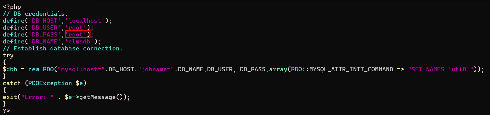

# ✅ Employee Leave Management System (ELMS) - Installation Guide

Download Project PHPGurukul:-https://phpgurukul.com/employee-leaves-management-system-elms/

## 📦 1. Upload ELMS Project to Server

- Transfer the .zip package to your server using scp:

    ```bash
    scp ~/Downloads/Employee-Leave-Management-System-PHP.zip root@192.168.1.11:/root/
    ```

## 📁 2. Extract Files

- SSH into your server:
    ```bash
    ssh root@192.168.1.11
    ```
- Then unzip the project:

    ```bash
    unzip Employee-Leave-Management-System-PHP.zip
    ```
- Remove Zip File.
    ```bash
    rm -rvf Employee-Leave-Management-System-PHP.zip
    ```
- If the folder name is something like ***Employee-Leave-Management-System-PHP***, change into it:
    ```bash
    cd Employee-Leave-Management-System-PHP
    ```
## 📂 3. Move/Copy Project Files to Web Directory
- Assuming you're using Apache and your web root is **/var/www/html**:
    
    ```bash
   cp -vr elms /var/www/html/
    ```
    Change the path:
    ```bash
    cd /var/www/html/
    ```
    Set correct permissions (Apache uses www-data as user):

    ```bash
    chown -Rv www-data:www-data elms
    ```
## 🛠️ 4. Database Setup

- Look for a **.sql** file in the project folder — commonly named something like **elms.sql** or **database.sql.**

    Import SQL into MySQL:
    <ol>
    <li>Log in to MySQL:</li>

    ```sql
    mysql -u root -p
    ```
    <li>Create a new database:</li>

    ```bash
    CREATE DATABASE elmsdb;
    ```
    <li>Check Database name:</li>

    ```bash
    SHOW DATABASES;
    ```
    <li>Exit login:</li>

    ```bash
    EXIT;
    ```
    ```bash
    cd /root/Employee-Leave-Management-System-PHP
    ```
    ```bash
    cd SQL\ File
    ```

    <li>Import the SQL file:</li>
    Exit MySQL and run:

    ```bash
     mysql -u root -p elmsdb < elmsdb.sql
    ```
    <li>Configure Root user:</li>

    ```bash
     cd /var/www/html/elms
    ```
    </ol>
## 📝 5. Configure Database Connection

Open the database config file — typically located in **/includes/config.php or dbconnection.php** similar:

For Main Application:
```bash
vim /var/www/html/elms/includes/config.php
```
For Admin Panel:
```bash
vim /var/www/html/elms/admin/includes/config.php
```


Update it with your database credentials.

## 🌐 6. Access the Application

Go to your browser:

http://your_server_IP/elms

You should see the Employee Leave Management System login page.

## 7.Login Details
- Admin Credential

    Username: admin

    Password: Test@12345

- Credential for User panel :

    Username: jhn12@gmail.com

    Password: Test@123

    Empid: 7856214 (in case of password recovery)