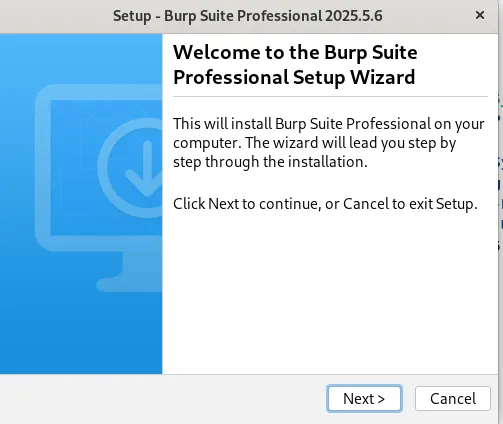
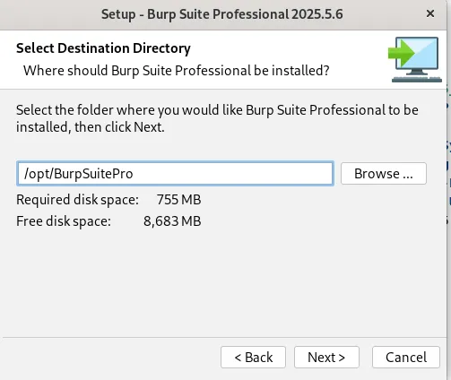
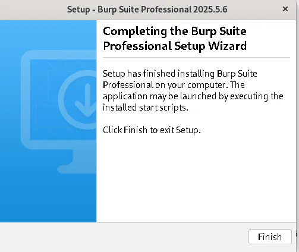
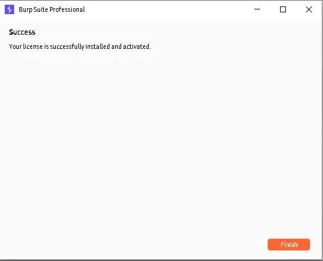

# 🔐 How to Install Burp Suite Pro on Linux (with Keygen) — Step-by-Step Guide


- Burp Suite Professional is a powerful tool for web application security testing. To install it on Kali Linux, follow the steps below:

## Prerequisites 📋
- In this guide, I’ll walk you through installing Burp Suite Pro on Linux with a keygen setup to activate it.

## 📥 Step 1: Download Burp Suite Pro
🔗 Official Burp Suite Pro Download Link : https://portswigger.net/burp/releases

or

https://portswigger.net/burp/releases/professional-community-2025-5-6

## 🔐 Keygen File Setup
https://mega.nz/file/bZ82wbYL#jAJxD4zs2yIPPTgKuSPk6tDDU8f0MsvX_UMBtts98cY
new link:https://mega.nz/folder/LWoB0BIa#7cyNATJ6a9i6HwEj_xXp6Q

## 🛠️ Step 2: Install Burp Suite Pro

- Open your terminal and follow the steps:

```bash
cd Downloads
```
```bash
chmod +x ./burpsuite_pro_linux_v2025_5_6.sh
```
```bash
./burpsuite_pro_linux_v2025_5_6.sh
```

- Then, follow the GUI installer prompts to complete the installation.







## 🧪 Step 3: Launch the Keygen
- Now it’s time to activate Burp Suite Pro using the Keygen.

```bash
mv -v BurpLoaderKeygen.jar /opt/BurpSuitePro/
```

```bash
cd /opt/BurpSuitePro
```

```bash
java -jar BurpLoaderKeygen.jar
```
### Change license name:


### This window will open:


### Copy highlighted text from keygen:


### Select Manual Activation:

+++

### Copy request:


### Paste in keygen:


### Copy activation response


### Paste here:


### Click on Finish:



## ⚙️ Step 4: Final Setup
Take the loader command text from the Burp Suite Loader & Keygen, and paste it into the Burp Suite Pro directory:

### Copy the Loader Command:


### Replace /opt/BurpSuitePro/BurpSuitePro file text with loader command:


Save the file.

Now you can run Burp Suite Pro anytime using:

```bash
BurpSuitePro
```
🎉 You’re Done!
You’ve successfully installed and activated Burp Suite Pro on your Linux machine. It’s now ready for web vulnerability scanning, proxy interception, and other powerful security testing.
