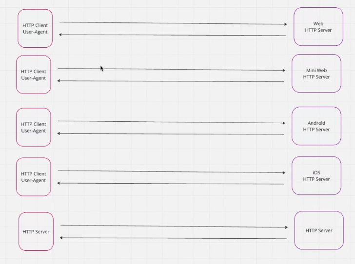
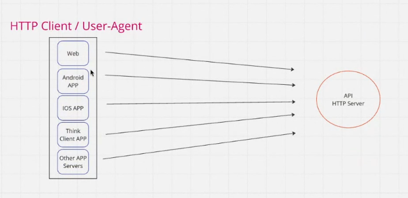

# 🔗 API (Application Programming Interface)

## 📌 What is an API?
An **API (Application Programming Interface)** is a **set of rules and protocols** that allows one software application to **communicate** with another.  

👉 Think of it as a **messenger** between two systems — it takes a request, tells the system what you want, and returns the response.

---

## ⚙️ How Does an API Work?

1. **Client (User/App)** → Sends a request (e.g., asking for user data).  
2. **API** → Acts as a middleman to process the request.  
3. **Server** → Provides the requested data/service.  
4. **API** → Returns the server’s response to the client.  

📷 **Diagram:**  



## API Work



Example:  
- You use a **Weather App**.  
- The app calls the **Weather API**.  
- The API fetches data from a weather server.  
- The app shows you today’s forecast.

---
## 🛠️ Types of APIs

### 1. 🌐 REST API
- Uses **HTTP methods** (`GET`, `POST`, `PUT`, `DELETE`).
- Commonly exchanges data in **JSON** or **XML**.
- Example:  
  ```http
  GET /users/1 HTTP/1.1
  Host: api.example.com
  ```

---

### 2. 📦 SOAP API
- Based on **XML messaging protocol**.
- More rigid, often used in **enterprise systems**.
- Example: Banking systems.

---

### 3. 🔎 GraphQL API
- Clients can request **exact data** they need.
- Reduces **over-fetching** of data.
- Example:  
  ```graphql
  {
    user(id: "1") {
      name
      email
    }
  }
  ```

---

### 4. ⚡ gRPC API
- High-performance, **binary protocol**.
- Uses **Protocol Buffers** (Protobuf).
- Example: Real-time services like **chat apps**.

---

### 5. 🔄 WebSocket API
- Enables **real-time two-way communication**.
- Example: Live chats, multiplayer games.

---

## 🚀 Why Use APIs?

- 🔗 **Integration** → Connect apps (e.g., payment gateways like PayPal/Stripe).  
- ⚡ **Efficiency** → Reuse existing services instead of building from scratch.  
- 🔒 **Security** → Control access via API keys/tokens.  
- 📡 **Scalability** → Supports modern cloud & mobile applications.  
- 🌍 **Standardization** → Provides consistent ways to exchange data.

---

## 🛠️ Example in Real Life

- 🗺️ **Google Maps API** → Embeds maps in apps/websites.  
- 💳 **Stripe API** → Secure online payments.  
- 📸 **Unsplash API** → Fetch free high-quality images.  
- 🤖 **OpenAI API** → Power chatbots and AI apps.  

---

## 📖 Summary
APIs are the **backbone of modern software** — they let apps, services, and systems **talk to each other securely and efficiently**.


