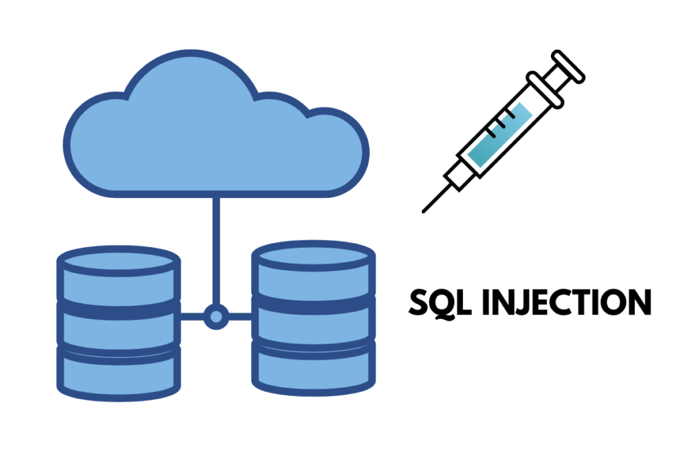
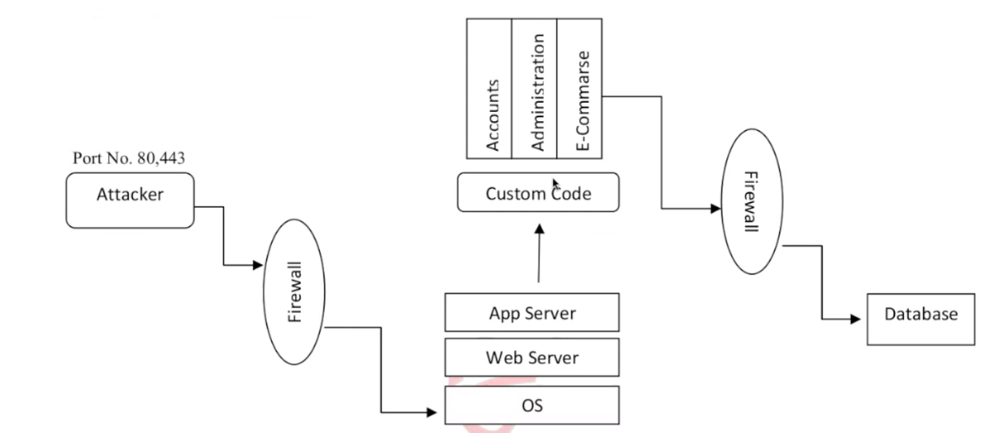

# 
SQL Injection (SQLi) 

SQL Injection (SQLi) is a common web application vulnerability that occurs when **untrusted input is concatenated into SQL queries** without proper sanitization or parameterization. This allows attackers to manipulate queries and interact with the database in unintended ways.

> ⚠️ SQLi is not a flaw in the database itself, but in the way web applications handle user input before querying the database.

---

## 💥 What SQL Injection Can Do

- 🔍 View sensitive data (usernames, passwords, financial data)
- ✏️ Modify data (insert, update, delete)
- 🛠️ Execute administration operations on the database(e.g.,delete the datebase)
- 📂 Bypass authentication and impersonate users.
- 🖥️ In Advanced cases, read system files or execute OS commands (if DB privileges allow)

---

## ❓ Why SQL Injection Happens

- Developers concatenate untrusted input into SQL queries
- Lack of input validation and sanitization
- Use of outdated or insecure libraries
- Poor implementation of access control
- Misconfigured web servers, DNS/ISP, or SQL software
- Failure to implement secure coding practices for application-layer flaws

---
## ❌Common Misconceptions 
- **Firewalls protect against SQL Injection**: Firewalls only protect ports; SQLi happens inside an allowed port (e.g., 80/443). 🌐

- **IDS detects SQL Injection**: IDS often detects known patterns; customized attacks can bypass it. 🧠

- **SSL protects against SQL Injection**: SSL encrypts traffic but doesn’t stop malicious input—it only hides it from network sniffers,(Man-in-the-middle attack). 🔒

---
##  🧪Types of SQL Injection

- **Classic SQL Injection:** Direct injection of malicious SQL into input fields. 💉
- **Blind SQL Injection:** When errors are hidden; data inferred via true/false responses or timing. ⏳
- **Union-Based SQL Injection:** Using the UNION operator to retrieve data from other tables. 🔗
- **Error-Based SQL Injection:** Forcing database errors to reveal structural info. ⚠️
- **Out-of-Band SQL Injection:** Using external channels (e.g., DNS/HTTP) when app is configured for it. 📡

---
## 🛡️Prevention Techniques 

- Use **parameterized queries** (prepared statements) instead of string concatenation. 🧱
- Employ **stored procedures** with strict validation. 📜
- Implement **input validation** (whitelisting acceptable inputs). ✅
- Enforce **least-privilege access** on database accounts. 🔐
- Use modern **ORM frameworks** carefully (still validate inputs). 🧰
- Regularly **conduct penetration tests** to detect vulnerabilities. 🧭

# 
Interview Question: 

- Q1.Out-of-band Injection
- Q2.Double Query Injection - What is Double Query Injection?