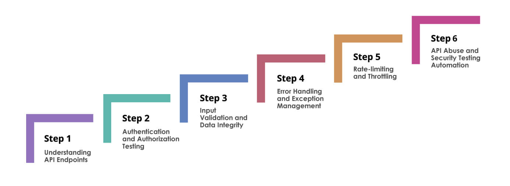

# 🔐 Authentication Testing (Web Pentesting)

## 🛡️ OWASP Authentication Testing – Overview

OWASP defines a **comprehensive set of authentication testing areas** to identify weaknesses in how web applications verify user identity.

These tests mainly focus on:

* 🔑 **Secure credential handling**
* 📜 **Authentication policy enforcement**
* 🚫 **Resistance to authentication bypass attempts**

### 🔄 Critical Authentication Workflows

Authentication testing applies to all major workflows such as:

* 📝 **User Registration**
* 🔓 **Login**
* 🔁 **Password Recovery / Reset**
* 📲 **Multi-Factor Authentication (MFA)**

📌 **Real-world bug bounty reports (e.g., HackerOne)** show that authentication issues like:

* 👤 **Account Takeovers**
* 🔢 **OTP Misuse**
* 🔓 **Weak 2FA Implementations**
  are among the **most impactful and frequently rewarded vulnerabilities**.

---

## ✅ Core OWASP Authentication Tests (Section 4.4)

OWASP Authentication Testing *(v4.x – Section 4.4)* defines **11 key checks**:

### 🔍 Authentication Test Checklist

1. 🔐 **Credentials transmitted only over encrypted channels** *(4.4.1)*
2. 🧩 **Presence of default or weak credentials** *(4.4.2)*
3. ⛔ **Ineffective account lockout mechanisms** *(4.4.3)*
4. 🕳️ **Authentication schema bypass** *(4.4.4)*
5. 💾 **Insecure “Remember Me” functionality** *(4.4.5)*
6. 🌐 **Browser cache weaknesses** *(4.4.6)*
7. ⏳ **Weak or outdated authentication methods** *(4.4.7)*
8. ❓ **Security question weaknesses** *(4.4.8)*
9. 🔁 **Password change and reset vulnerabilities** *(4.4.9)*
10. 📡 **Weaker authentication via alternative channels** *(4.4.10)*
11. 📲 **Multi-Factor Authentication (MFA) implementation flaws** *(4.4.11)*

---
## 🔗 Mapping Application Workflows to OWASP Areas

These mappings ensure full coverage of **identity lifecycle controls** and **active authentication enforcement**:

* 📝 **Registration, Email Verification, OTP Validation**
  → 🆔 *Identity Management Testing* **(4.3.2 – 4.3.4)**

* 🔑 **Login, Password Recovery, Two-Factor Authentication (2FA)**
  → 🔐 *Authentication Testing* **(4.4.1 – 4.4.11)**

* 🛠️ **Update/Delete User Details, API Key Authentication**
  → 🕳️ *Authentication Schema & Bypass Testing* **(4.4.4)**
  → ✅ Includes **authorization validation**

---

## 🚨 Common Authentication Vulnerabilities *(Observed in HackerOne Reports)*

Analysis of high-impact disclosures shows recurring authentication failures:

* 🍪 **Session / Cookie Leakage**
  → Leads to **full account takeover**

* 🔓 **2FA Bypass**
  → Via **race conditions**, **logic flaws**, or **disabled states**

* 🔢 **Improper OTP Handling**
  → Especially during **password recovery**

* 📲 **Weak MFA Enforcement**
  → On **mobile**, **API**, or **legacy flows**

* 🧠 **Business Logic Flaws**
  → In **reset workflows** and **concurrent session handling**

---

## 📊 Representative Vulnerability Examples

| 🔎 Vulnerability Type   | 📘 OWASP Test | 🌍 Real-World Example                        |
| ----------------------- | ------------- | -------------------------------------------- |
| 🚫 Weak Lockout         | 4.4.3         | Unlimited brute-force login attempts         |
| 🕳️ Auth Schema Bypass  | 4.4.4         | 2FA bypass via account state manipulation    |
| 📲 MFA Weakness         | 4.4.11        | Reusable OTPs, race-condition skips          |
| 🔁 Password Reset Flaws | 4.4.9         | Predictable/exposed tokens, no rate limiting |

---

## 🔄 Workflow-Based Testing Approach (Web Pentesting)

A **structured workflow-based approach** greatly improves the detection of **authentication flaws** by testing how users move through real application flows instead of isolated endpoints.

## 📝 Registration & Verification

* 🧪 Test **invalid and malicious inputs**
* 🔍 Check for **user enumeration vectors**
* 🚫 Attempt **verification bypasses**
* 📘 OWASP Reference: **Identity Management Testing (4.3.4)**

---

## 🔐 Login & OTP Validation

* 🔒 Confirm credentials are sent over **encrypted transport (HTTPS)**
* 🛑 Test **brute-force protections**
* ⛔ Validate **account lockout enforcement**
* 📘 OWASP References:

  * Encrypted Transport → **4.4.1**
  * Lockout Mechanisms → **4.4.3**

---

## 🔁 Password Recovery

* 🎲 Validate **reset token entropy**
* ⏳ Check **token expiry**
* 🚦 Test **rate limiting**
* 🕵️ Ensure **no information disclosure** (e.g., user existence leaks)
* 📘 OWASP Reference: **Password Reset Testing (4.4.9)**

---

## 🔑 API Key Authentication

* 🕳️ Test for **authentication schema bypass**
* 🔄 Check **improper fallback mechanisms**
* 🔌 Validate behavior across **API & alternative auth paths**
* 📘 OWASP Reference: **Auth Schema & Bypass Testing (4.4.4)**

---

## 🧾 Post-Authentication Actions

* 🔄 Ensure **re-authentication** for sensitive actions (update/delete)
* 🧠 Validate **proper session handling**
* 🔗 Link findings with **Session Management Testing**
* 📘 OWASP Reference: **Session Management (4.6)**

---

## ⭐ Key Takeaway

Authentication vulnerabilities are **rarely caused by missing controls alone**.

🚨 The most common root causes are:

* 🧠 **Logic flaws**
* 🔀 **Inconsistent enforcement**
* 🛣️ **Alternative or hidden workflows**

🎯 Aligning **real-world workflow testing** with the **OWASP Authentication Framework** significantly improves protection against:

* 👤 **Account Takeover (ATO)**
* 📲 **MFA / 2FA Bypass Risks**

---

📘 *Best suited for:*

* Bug bounty hunters 🐞
* OSCP / CEH exam prep
* Real-world web & API pentesting
