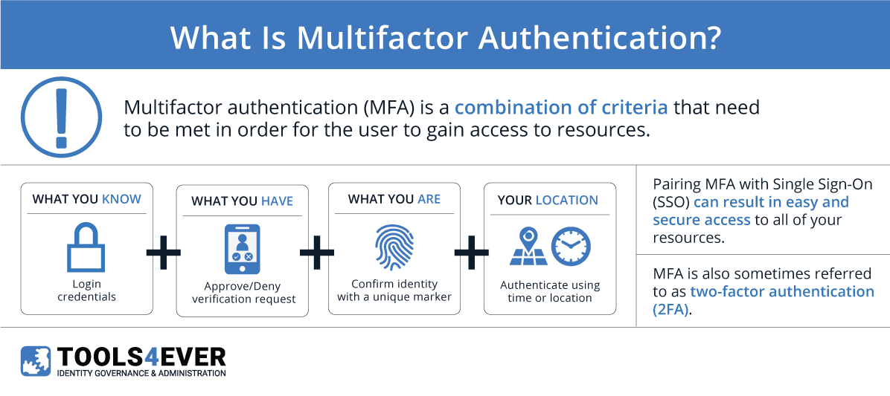

# 👤 Username Enumeration via Different Responses

🔗 **Lab Reference:**
[lab-username-enumeration-via-different-responses](https://portswigger.net/web-security/authentication/password-based lab-username-enumeration-via-different-responses)

**Username enumeration** occurs when an application reveals whether a **username (or email/phone)** exists based on **differences in responses** during authentication-related workflows.

Attackers exploit these differences to build a list of **valid accounts**, which can then be used for:

* 🔨 **Brute force**
* 🔑 **Credential stuffing**
* 🎯 **Targeted phishing**

---

## 📍 Where It Commonly Appears (OWASP Mapping)

* 🔐 **Login**
  → OWASP **4.4.3** *(Lockout)*
  → OWASP **4.4.7** *(Weak Authentication Methods)*

* 📝 **Registration**
  → OWASP **4.3.4** *(Account Enumeration)*

* 🔁 **Password Reset / Recovery**
  → OWASP **4.4.9**

* 📲 **MFA / OTP Flows**
  → OWASP **4.4.11**

---

## 🚨 Enumeration Indicators

Enumeration is possible when **responses differ** based on **username validity**, such as:

## 1️⃣ Error Message Differences

| 🧪 Scenario                        | 💬 Response             |
| ---------------------------------- | ----------------------- |
| ✅ Valid username, ❌ wrong password | `"Incorrect password"`  |
| ❌ Invalid username                 | `"User does not exist"` |

---

## 2️⃣ HTTP Status Code Variations

* ✅ **200 OK** → Existing users
* ❌ **404 Not Found** or **401 Unauthorized** → Non-existing users

---

## 3️⃣ Response Time Differences ⏱️

Username enumeration can occur when **response times vary** based on whether a user exists.

* 🕒 **Longer processing time for existing users**
  *(e.g., password hash verification, OTP generation)*

* ⚡ **Instant rejection for non-existing users**

📌 Attackers can measure timing differences to confirm **valid usernames**.

---

## 4️⃣ Password Reset Disclosure 🔁

Enumeration often appears in **password recovery flows**:

* 📧 `"Password reset email sent"` **vs** `"Email not registered"`
* 🔢 **OTP sent only for valid accounts**

⚠️ These differences directly reveal whether an account exists.

---

## 5️⃣ MFA / OTP Behavior 📲

MFA implementations can also leak user existence:



* 🔐 **OTP generated or validated only if the username exists**
* ❌ Different error messages for:

  * Invalid username
  * Invalid OTP

📌 Even secure MFA can fail if responses are **not normalized**.

---

## 🧪 Example Test Cases

### 🔐 Login Enumeration

```http
POST /login
username=valid_user&password=wrong
→ "Invalid password"
```

```http
POST /login
username=invalid_user&password=wrong
→ "User not found"
```

✅ Difference in responses = **Username Enumeration**

---

### 🔁 Password Reset Enumeration

```http
POST /forgot-password
email=valid@example.com
→ "Reset link sent"
```

```http
POST /forgot-password
email=invalid@example.com
→ "Email not registered"
```
---
### 📝 Registration Enumeration

```http
POST /register
email=existing@example.com
→ "Email already exists"
```

📌 The response clearly confirms that the email is already registered, enabling **account enumeration during registration**.

---

## 🚨 Impact

* 🔎 **Enables account discovery at scale**
* 🔐 **Facilitates credential stuffing & brute-force attacks**
* 🎯 **Increases effectiveness of phishing & social engineering**
* 🔗 **Often chained with weak lockout or MFA bypasses**

---

## 🛡️ Recommended Mitigations

* 🧾 Use **generic, uniform error messages**

  * Example: `"Invalid username or password"`

* 🌐 Return **consistent HTTP status codes**

* ⏱️ **Normalize response time** (constant-time checks)

* 🔁 Always show the **same response for password reset requests**

* 🚦 **Rate-limit** authentication and recovery endpoints

* 📊 **Log and monitor** enumeration attempts

---

## ✅ Sample Secure Response Pattern

```text
If the account exists, you will receive further instructions.
```

📌 *(Used for login errors, password reset, and OTP initiation)*

---

## ⚠️ Severity

* **Medium → High**
  (Depends on chaining with brute force, credential stuffing, or MFA bypass)

---

